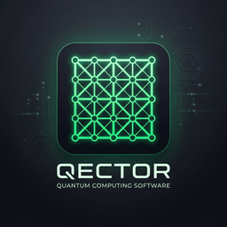

<p align="center">
  
</p>

<h1 align="center">QECTOR Decoder Workbench for macOS</h1>

<p align="center">
  <strong>Professional Quantum Error Correction Analysis Suite (Apple Silicon Native)</strong><br/>
  <em>17 Decoders · 10 Code Families · 85-Tool MCP Server · Metal Acceleration · Claude Plugin</em>
</p>

<p align="center">
  
  
  
  
  
  
</p>

<p align="center">
  <a href="https://www.qector.store">Website</a> ·
  <a href="#-quick-start">Quick Start</a> ·
  <a href="#-claude-desktop--ai-agents-mcp">Claude & MCP</a> ·
  <a href="#-features">Features</a> ·
  <a href="#-decoders--code-families">Decoders</a> ·
  <a href="manuals/QECTOR_API_Reference.md">API Reference</a> ·
  <a href="#-license">License</a>
</p>

---

## 📖 Overview

**QECTOR Decoder Workbench for macOS** is a high-performance desktop application for quantum error correction (QEC) research, decoder evaluation, and automated benchmarking. Built natively for Apple Silicon (`arm64`), it combines the ultra-fast `qector-decoder-v3` Rust/PyO3 engine with an interactive CustomTkinter GUI, high-throughput batch simulation, hardware acceleration routing, and a comprehensive 85-tool Model Context Protocol (MCP) server for LLM agents.

> **Native · Zero Dependencies · Air-Gapped Ready**
> Mount the DMG. Drag to `/Applications`. Launch and decode.

---

## 🚀 Quick Start

### 1. Download & Install Native DMG

1. Download **[`QectorWorkbench-1.0.1-arm64.dmg`](https://github.com/iD01t/QECTOR-Workbench-MacOS/releases/latest)** from Releases.
2. Double-click the `.dmg` to mount the disk image.
3. Drag **`QectorWorkbench.app`** into your **`/Applications`** folder.
4. Launch **QectorWorkbench** from Spotlight, Launchpad, or Applications.

```bash
# If macOS Gatekeeper flags the downloaded bundle:
xattr -dr com.apple.quarantine /Applications/QectorWorkbench.app
```

---

### 2. CLI Mode

You can run the frozen macOS application directly from Terminal:

```bash
# Define binary alias
APP="/Applications/QectorWorkbench.app/Contents/MacOS/QectorWorkbench"

# Run self-test
"$APP" --decoder-selftest

# Decode quantum error syndrome
"$APP" --cli decode --family rotated_surface --distance 5 --decoder blossom

# Benchmark decoding throughput
"$APP" --cli benchmark --code toric --distance 7 --samples 10000

# Inspect system & hardware routing diagnostics
"$APP" --cli diagnostics
```

---

### 3. Claude Desktop & AI Agents (MCP)

QECTOR Workbench includes a local-only Model Context Protocol (MCP) server exposing **85 quantum error correction tools**.

#### Official Claude Plugin
You can also connect via the official Claude Desktop extension:
👉 **[guillaumelessard/qector-claude-plugin](https://github.com/guillaumelessard/qector-claude-plugin)**

#### Manual Claude Desktop Configuration (`~/Library/Application Support/Claude/claude_desktop_config.json`):

```json
{
  "mcpServers": {
    "qector": {
      "command": "/Applications/QectorWorkbench.app/Contents/MacOS/QectorWorkbench",
      "args": ["--mcp"]
    }
  }
}
```

---

## 🔬 Decoders & Code Families

### 17 Built-In Decoders
- **Blossom / MWPM** (Minimum-Weight Perfect Matching via Rust/PyO3)
- **Union-Find** (Linear-time cluster growth & peeling)
- **BP-OSD** (Belief Propagation with Ordered Statistics Decoding)
- **Belief Matching** (Soft-syndrome BP initialization + MWPM)
- **Tensor Network** (Exact & matrix-product MPS contraction)
- **Neural Network / ML** (Learned syndrome classification & RL)
- **Lookup Table (LUT)** (Sub-microsecond exact caching)
- **Pivoting / Gaussian Elimination**
- **Hard-Decision & Soft-Decision Decoders**

### 10 Code Families
- **Surface Codes** (Planar, Rotated Surface)
- **Toric Codes** (Periodic boundary 2D lattices)
- **Color Codes** (Triangular 4.8.8, 6.6.6)
- **qLDPC Codes** (Bivariate bicycle, lifted product, hypergraph)
- **Repetition Codes** (Bit-flip & phase-flip chains)
- **Heavy-Hex Codes** (IBM-style sparse coupling layouts)
- **Bacon-Shor Codes** (Subsystem gauge codes)
- **CSS Codes** (Arbitrary parity-check matrix support)

---

## 🛠️ Building from Source (macOS)

```bash
# Clone the repository
git clone https://github.com/iD01t/QECTOR-Workbench-MacOS.git
cd QECTOR-Workbench-MacOS/Mac

# Install dependencies using bundled arm64 wheels
python3 -m pip install --find-links wheels --prefer-binary -r requirements.txt pyinstaller

# Build .app and .dmg
./build_macos.sh --arch arm64
```

---

## 📊 Verified Build Facts

| Metric | Specification |
|:-------|:--------------|
| **Workbench Version** | `1.0.1` |
| **Backend Engine** | `qector_decoder_v3` `1.0.0` (Rust / PyO3) |
| **Target Architecture** | Apple Silicon (`arm64`, macOS 11.0+) |
| **MCP Server Tools** | 85 Tools (stdio JSON-RPC 2.0) |
| **Packaging Format** | Native compressed `.dmg` (UDZO disk image) |
| **Security & Privacy** | 100% Local execution · Zero telemetry · Air-gap ready |

---

## 📄 License & Compliance

- **Academic & Non-Commercial Research**: Free and source-available.
- **Commercial Use**: Licensing and commercial evaluation available at [qector.store](https://qector.store).
- See [`EULA.txt`](EULA.txt) and [`SECURITY.md`](SECURITY.md) for complete details.
